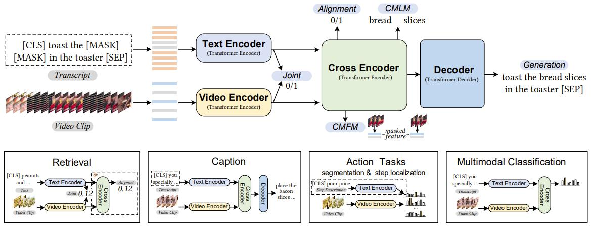
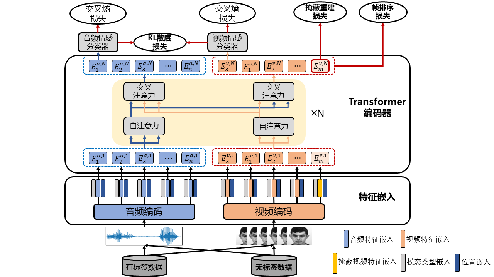

The implementation of paper [**UniVL: A Unified Video and Language Pre-Training Model for Multimodal Understanding and Generation**](https://arxiv.org/abs/2002.06353). 

UniVL is a **video-language pretrain model**. It is designed with four modules and five objectives for both video language understanding and generation tasks. It is also a flexible model for most of the multimodal downstream tasks considering both efficiency and effectiveness.




# Preliminary
Execute below scripts in the main folder firstly. It will avoid *download conflict* when doing distributed pretrain.
```
mkdir modules/bert-base-uncased
cd modules/bert-base-uncased/
wget https://s3.amazonaws.com/models.huggingface.co/bert/bert-base-uncased-vocab.txt
mv bert-base-uncased-vocab.txt vocab.txt
wget https://s3.amazonaws.com/models.huggingface.co/bert/bert-base-uncased.tar.gz
tar -xvf bert-base-uncased.tar.gz
rm bert-base-uncased.tar.gz
cd ../../
```

# Requirements
- python==3.6.9
- torch==1.7.0+cu92
- tqdm
- boto3
- requests
- pandas
- nlg-eval (Install Java 1.8.0 (or higher) firstly)
```
conda create -n py_univl python=3.6.9 tqdm boto3 requests pandas
conda activate py_univl
pip install torch==1.7.1+cu92
pip install git+https://github.com/Maluuba/nlg-eval.git@master
```

# Pretrained Weight
```
mkdir -p ./weight
wget -P ./weight https://github.com/microsoft/UniVL/releases/download/v0/univl.pretrained.bin
```

# Prepare for Evaluation 
Get data for retrieval and caption (with only video input) on YoucookII and MSRVTT.
## YoucookII
```
mkdir -p data
cd data
wget https://github.com/microsoft/UniVL/releases/download/v0/youcookii.zip
unzip youcookii.zip
cd ..
```
Note: you can find `youcookii_data.no_transcript.pickle` in the zip file, which is a version without transcript. The transcript version will not be publicly avaliable due to possible legal issue. Thus, you need to replace `youcookii_data.pickle` with `youcookii_data.no_transcript.pickle` for youcook retrieval task and *caption with only video input* task. S3D feature can be found in `youcookii_videos_features.pickle`. The feature is extract as one 1024-dimension vector per second. More details can be found in [dataloaders](./dataloaders/README.md) and our paper.

## MSRVTT
```
mkdir -p data
cd data
wget https://github.com/microsoft/UniVL/releases/download/v0/msrvtt.zip
unzip msrvtt.zip
cd ..
```

# Finetune on YoucookII
## Retrieval

1. Run retrieval task on **YoucookII**

```
DATATYPE="youcook"
TRAIN_CSV="data/youcookii/youcookii_train.csv"
VAL_CSV="data/youcookii/youcookii_val.csv"
DATA_PATH="data/youcookii/youcookii_data.pickle"
FEATURES_PATH="data/youcookii/youcookii_videos_features.pickle"
INIT_MODEL="weight/univl.pretrained.bin"
OUTPUT_ROOT="ckpts"

python -m torch.distributed.launch --nproc_per_node=4 \
main_task_retrieval.py \
--do_train --num_thread_reader=16 \
--epochs=5 --batch_size=32 \
--n_display=100 \
--train_csv ${TRAIN_CSV} \
--val_csv ${VAL_CSV} \
--data_path ${DATA_PATH} \
--features_path ${FEATURES_PATH} \
--output_dir ${OUTPUT_ROOT}/ckpt_youcook_retrieval --bert_model bert-base-uncased \
--do_lower_case --lr 3e-5 --max_words 48 --max_frames 48 \
--batch_size_val 64 --visual_num_hidden_layers 6 \
--datatype ${DATATYPE} --init_model ${INIT_MODEL}
```
The results (FT-Joint) are close to `R@1: 0.2269 - R@5: 0.5245 - R@10: 0.6586 - Median R: 5.0`

Plus `--train_sim_after_cross` to train align approach (FT-Align),

The results (FT-Align) are close to `R@1: 0.2890 - R@5: 0.5760 - R@10: 0.7000 - Median R: 4.0`

2. Run retrieval task on **MSRVTT**
```
DATATYPE="msrvtt"
TRAIN_CSV="data/msrvtt/MSRVTT_train.9k.csv"
VAL_CSV="data/msrvtt/MSRVTT_JSFUSION_test.csv"
DATA_PATH="data/msrvtt/MSRVTT_data.json"
FEATURES_PATH="data/msrvtt/msrvtt_videos_features.pickle"
INIT_MODEL="weight/univl.pretrained.bin"
OUTPUT_ROOT="ckpts"

python -m torch.distributed.launch --nproc_per_node=4 \
main_task_retrieval.py \
--do_train --num_thread_reader=16 \
--epochs=5 --batch_size=128 \
--n_display=100 \
--train_csv ${TRAIN_CSV} \
--val_csv ${VAL_CSV} \
--data_path ${DATA_PATH} \
--features_path ${FEATURES_PATH} \
--output_dir ${OUTPUT_ROOT}/ckpt_msrvtt_retrieval --bert_model bert-base-uncased \
--do_lower_case --lr 5e-5 --max_words 48 --max_frames 48 \
--batch_size_val 64 --visual_num_hidden_layers 6 \
--datatype ${DATATYPE} --expand_msrvtt_sentences --init_model ${INIT_MODEL}
```
The results (FT-Joint) are close to 
`R@1: 0.2720 - R@5: 0.5570 - R@10: 0.6870 - Median R: 4.0`

Plus `--train_sim_after_cross` to train align approach (FT-Align)

## Caption
Run caption task on **YoucookII**

```
TRAIN_CSV="data/youcookii/youcookii_train.csv"
VAL_CSV="data/youcookii/youcookii_val.csv"
DATA_PATH="data/youcookii/youcookii_data.pickle"
FEATURES_PATH="data/youcookii/youcookii_videos_features.pickle"
INIT_MODEL="weight/univl.pretrained.bin"
OUTPUT_ROOT="ckpts"

python -m torch.distributed.launch --nproc_per_node=4 \
main_task_caption.py \
--do_train --num_thread_reader=4 \
--epochs=5 --batch_size=16 \
--n_display=100 \
--train_csv ${TRAIN_CSV} \
--val_csv ${VAL_CSV} \
--data_path ${DATA_PATH} \
--features_path ${FEATURES_PATH} \
--output_dir ${OUTPUT_ROOT}/ckpt_youcook_caption --bert_model bert-base-uncased \
--do_lower_case --lr 3e-5 --max_words 128 --max_frames 96 \
--batch_size_val 64 --visual_num_hidden_layers 6 \
--decoder_num_hidden_layers 3 --stage_two \
--init_model ${INIT_MODEL}
```
>The results are close to 
```
BLEU_1: 0.4746, BLEU_2: 0.3355, BLEU_3: 0.2423, BLEU_4: 0.1779
METEOR: 0.2261, ROUGE_L: 0.4697, CIDEr: 1.8631
```

If using video only as input (`youcookii_data.no_transcript.pickle`),
>The results are close to 
```
BLEU_1: 0.3921, BLEU_2: 0.2522, BLEU_3: 0.1655, BLEU_4: 0.1117
METEOR: 0.1769, ROUGE_L: 0.4049, CIDEr: 1.2725
```

Run caption task on **MSRVTT**

```
DATATYPE="msrvtt"
TRAIN_CSV="data/msrvtt/MSRVTT_train.9k.csv"
VAL_CSV="data/msrvtt/MSRVTT_JSFUSION_test.csv"
DATA_PATH="data/msrvtt/MSRVTT_data.json"
FEATURES_PATH="data/msrvtt/msrvtt_videos_features.pickle"
INIT_MODEL="weight/univl.pretrained.bin"
OUTPUT_ROOT="ckpts"

python -m torch.distributed.launch --nproc_per_node=4 \
main_task_caption.py \
--do_train --num_thread_reader=4 \
--epochs=5 --batch_size=128 \
--n_display=100 \
--train_csv ${TRAIN_CSV} \
--val_csv ${VAL_CSV} \
--data_path ${DATA_PATH} \
--features_path ${FEATURES_PATH} \
--output_dir ${OUTPUT_ROOT}/ckpt_msrvtt_caption --bert_model bert-base-uncased \
--do_lower_case --lr 3e-5 --max_words 48 --max_frames 48 \
--batch_size_val 32 --visual_num_hidden_layers 6 \
--decoder_num_hidden_layers 3 --datatype ${DATATYPE} --stage_two \
--init_model ${INIT_MODEL}
```
>The results are close to 
```
BLEU_1: 0.8051, BLEU_2: 0.6672, BLEU_3: 0.5342, BLEU_4: 0.4179
METEOR: 0.2894, ROUGE_L: 0.6078, CIDEr: 0.5004
```

# Pretrain on HowTo100M

## Format of csv
```
video_id,feature_file
Z8xhli297v8,Z8xhli297v8.npy
...
```

## Stage I
```
ROOT_PATH=.
DATA_PATH=${ROOT_PATH}/data
SAVE_PATH=${ROOT_PATH}/models
MODEL_PATH=${ROOT_PATH}/UniVL
python -m torch.distributed.launch --nproc_per_node=8 \
${MODEL_PATH}/main_pretrain.py \
 --do_pretrain --num_thread_reader=0 --epochs=50 \
--batch_size=1920 --n_pair=3 --n_display=100 \
--bert_model bert-base-uncased --do_lower_case --lr 1e-4 \
--max_words 48 --max_frames 64 --batch_size_val 344 \
--output_dir ${SAVE_PATH}/pre_trained/L48_V6_D3_Phase1 \
--features_path ${DATA_PATH}/features \
--train_csv ${DATA_PATH}/HowTo100M.csv \
--data_path ${DATA_PATH}/caption.pickle \
--visual_num_hidden_layers 6 --gradient_accumulation_steps 16 \
--sampled_use_mil --load_checkpoint
```
```
ROOT_PATH=.
DATA_PATH=${ROOT_PATH}/data
SAVE_PATH=${ROOT_PATH}/models
MODEL_PATH=${ROOT_PATH}/UniVL
python -m torch.distributed.launch --nproc_per_node=8 \
${MODEL_PATH}/main_pretrain.py \
 --do_pretrain --num_thread_reader=0 --epochs=50 \
--batch_size=1920 --n_pair=3 --n_display=100 \
--bert_model bert-base-uncased --do_lower_case --lr 1e-4 \
--max_words 48 --max_frames 64 --batch_size_val 344 \
--output_dir ${SAVE_PATH}/pre_trained/L48_V6_D3_Phase1 \
--features_path ${DATA_PATH}/features \
--train_csv ${DATA_PATH}/HowTo100M.csv \
--data_path ${DATA_PATH}/caption.pickle \
--visual_num_hidden_layers 6 --gradient_accumulation_steps 16 \
--sampled_use_mil --load_checkpoint
```
```
ROOT_PATH=.
DATA_PATH=${ROOT_PATH}/data
SAVE_PATH=${ROOT_PATH}/models
MODEL_PATH=${ROOT_PATH}/UniAV
python -m torch.distributed.launch --nproc_per_node=8 \
${MODEL_PATH}/main_pretrain.py \
 --do_pretrain --num_thread_reader=0 --epochs=50 \
--batch_size=1920 --n_pair=3 --n_display=100 \
--bert_model bert-base-uncased --do_lower_case --lr 1e-4 \
--max_words 48 --max_frames 64 --batch_size_val 344 \
--output_dir ${SAVE_PATH}/pre_trained/L48_V6_D3_Phase1 \
--features_path ${DATA_PATH}/feature \
--visual_num_hidden_layers 6 --gradient_accumulation_steps 16 
```
## Stage II
```
ROOT_PATH=.
DATA_PATH=${ROOT_PATH}/data
SAVE_PATH=${ROOT_PATH}/models
MODEL_PATH=${ROOT_PATH}/UniVL
INIT_MODEL=<from first stage>
python -m torch.distributed.launch --nproc_per_node=8 \
${MODEL_PATH}/main_pretrain.py \
--do_pretrain --num_thread_reader=0 --epochs=50 \
--batch_size=960 --n_pair=3 --n_display=100 \
--bert_model bert-base-uncased --do_lower_case --lr 1e-4 \
--max_words 48 --max_frames 64 --batch_size_val 344 \
--output_dir ${SAVE_PATH}/pre_trained/L48_V6_D3_Phase2 \
--features_path ${DATA_PATH}/features \
--train_csv ${DATA_PATH}/HowTo100M.csv \
--data_path ${DATA_PATH}/caption.pickle \
--visual_num_hidden_layers 6 --decoder_num_hidden_layers 3 \
--gradient_accumulation_steps 60 \
--stage_two --sampled_use_mil \
--pretrain_enhance_vmodal \
--load_checkpoint --init_model ${INIT_MODEL}
```

# Citation
If you find UniVL useful in your work, you can cite the following paper:
```
@Article{Luo2020UniVL,
  author  = {Huaishao Luo and Lei Ji and Botian Shi and Haoyang Huang and Nan Duan and Tianrui Li and Jason Li and Taroon Bharti and Ming Zhou},
  title   = {UniVL: A Unified Video and Language Pre-Training Model for Multimodal Understanding and Generation},
  journal = {arXiv preprint arXiv:2002.06353},
  year    = {2020},
}
```

# License
This project is licensed under the license found in the LICENSE file in the root directory of this source tree.

[Microsoft Open Source Code of Conduct](https://opensource.microsoft.com/codeofconduct)

# Acknowledgments
Our code is based on [pytorch-transformers v0.4.0](https://github.com/huggingface/transformers/tree/v0.4.0) and [howto100m](https://github.com/antoine77340/howto100m). We thank the authors for their wonderful open-source efforts.
